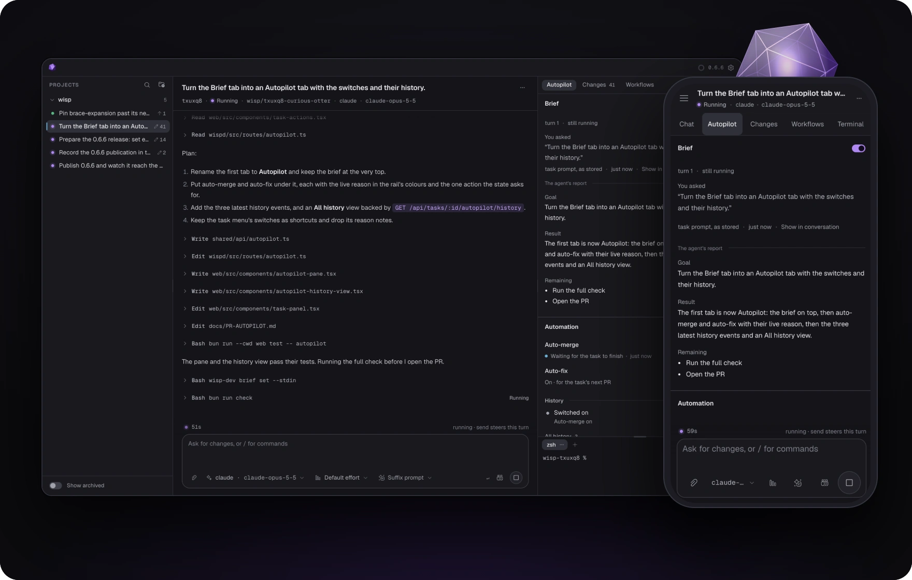

https://github.com/user-attachments/assets/93c9376d-e671-44b8-9f34-82a747d929da

<div align="center">

<p>Run your coding agents in parallel, each task in its own worktree.<br />
Wisp follows every task through: red CI and review comments go back to the agent,<br />
the PR merges when it's ready, and a brief is waiting for you when you're back.</p>

<p>Self-hosted · No Wisp account · Works with Droid, Claude Code, Codex, Cursor, and OpenCode</p>

</div>

<p align="center"></p>

## What Wisp does

- **Run agents side by side.** Start several tasks at once, each with the
  agent you already use, signed in as you. Every task gets its own Git worktree
  and branch, so their edits never collide.
- **Follow every PR to the end.** With auto-fix on, Wisp sends failing CI,
  merge conflicts and review comments back to the agent until the PR is green.
  With auto-merge on, Wisp merges it once its checks pass and reviews allow.
  Both are switches on the task. [How it works](docs/PR-AUTOPILOT.md)
- **Keep watch while you're away.** A heartbeat wakes a task on a schedule
  until its goal is met: "check staging until the smoke test passes." Each
  wake-up is an agent turn. A scheduled steer sends your next instruction at
  the time you pick.
  [Workflows](docs/WORKFLOWS.md)
- **Read a brief, not a transcript.** At the end of each turn the agent
  reports what it did, what's left, and any decision it needs from you, with
  the option it recommends. Answer in one line. [Briefs](skills/wisp/references/cli.md#task-briefs)
- **See the whole picture.** Read the conversation, review the diff, open a
  terminal in the worktree, and see the diagrams agents draw rendered right in
  the chat.
- **Check in from anywhere.** The desktop app on macOS posts a banner when a
  task's PR needs you and when Wisp merges it. The same UI runs in any browser
  and on your phone over a [private connection](docs/REMOTE-ACCESS.md), and the
  `wisp` CLI scripts it all. Tasks keep running when you close the window.
- **Yours, end to end.** Wisp runs on your Mac or your Linux server, with your
  agents and your GitHub account. There is no Wisp account and no Wisp cloud.

## Install

You need Git, a repository, and at least one coding agent installed and signed
in. Wisp itself needs no Node or Bun.

**macOS, Apple Silicon**

```sh
brew install Pepewitch/tap/wisp Pepewitch/tap/wisp-desktop
open -a Wisp
```

The app walks you through setup: add a repository and start your first task.
Name both packages; Homebrew only trusts fully qualified names from a
third-party tap. More in the [macOS guide](docs/INSTALL-MACOS.md).

**Linux, x86_64**

```sh
curl --proto '=https' --tlsv1.2 -fsSL \
  https://raw.githubusercontent.com/Pepewitch/wisp/v0.6.7/scripts/install.sh | sh
```

The installer verifies the download, installs under your home directory
without `sudo`, and starts a systemd user service when it can. More in the
[Linux guide](docs/INSTALL.md).

## Start from the CLI

```sh
wisp project add /path/to/repo
wisp doctor --harness claude
wisp new /path/to/repo "Fix the flaky retry test and open a PR." --harness claude --auto-fix
wisp token
```

`wisp token` prints the address of the web UI and a token to sign in with.
Keep the token private. `wisp help` lists every command.

## Before you run an agent

**A worktree is not a sandbox.** Agents run as your OS user with their
approval prompts off, so they can reach files, credentials and the network
outside the task's checkout. Use repositories you trust, review what changes,
and give untrusted work its own OS account or a disposable VM. Auto-merge
merges under your GitHub account: turn it on for work you'd merge yourself
once CI is green.

Wisp is pre-1.0 and built for one person. The desktop app needs Apple Silicon
and macOS 12.3 or later. On Linux, Wisp needs x86_64 and glibc 2.17 or later,
and is tested on Ubuntu 24.04. Intel Macs and Windows aren't supported.

## Learn more

- [Auto-merge and auto-fix](docs/PR-AUTOPILOT.md)
- [Workflows: heartbeats and scheduled steers](docs/WORKFLOWS.md)
- [Task briefs](skills/wisp/references/cli.md#task-briefs)
- [Phone and remote access](docs/REMOTE-ACCESS.md)
- [CLI reference](skills/wisp/references/cli.md)
- [Storage, archive and cleanup](docs/ARCHIVE-CLEANUP.md)
- [Security](SECURITY.md) · [Changelog](CHANGELOG.md) · [Releases](https://github.com/Pepewitch/wisp/releases)

## Contributing

Bug reports, documentation fixes and small PRs are welcome. Start with
[CONTRIBUTING.md](CONTRIBUTING.md) for local setup and checks, or
[ARCHITECTURE.md](docs/ARCHITECTURE.md) for how the pieces fit together.

[MIT](LICENSE) © 2026 pepewitch
